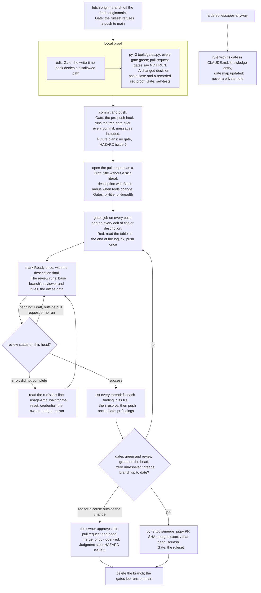

The order is the order in which a change meets its gates. The commands are in the skill
`.claude/skills/change-walk/SKILL.md`; this entry is the picture of it.

## Update triggers

- `.claude/skills/change-walk/SKILL.md` changes: the whole walk.
- `.github/workflows/gates.yml` (its triggers) changes: nodes D and E.
- `.github/workflows/review.yml` (triggers, the job's `if`) changes: nodes F and G.
- `tools/merge_pr.py` changes what it refuses or waives: nodes J, K and N.
- `tools/pr_gates.py` changes a pull-request gate: nodes D and I.
