The order is the order in which a change meets its gates. The commands are in the skill
`.claude/skills/change-walk/SKILL.md`; this entry is the picture of it. What turns each gate red
is on the gate map, [[diagram-gate-map]].

```mermaid
flowchart TD
    A["fetch origin; branch off the fresh origin/main.
    Gate: the ruleset refuses a push to main"] --> B
    subgraph B["Local proof"]
        B1["edit. Gate: the write-time hook denies a disallowed path.
        A write through a shell command passes it: HAZARD issue 4"] --> B2
        B2["py -3 tools/gates.py. Red on a FAIL, a BROKEN, or a PARTLY of any gate but merge-checks.
        The pull-request gates say NOT RUN until a pull request exists.
        Gate: the exit code of the run"] --> B3
        B3["a changed decision in a tool has a case and a recorded red proof.
        self-tests replays what is recorded; it cannot see a decision that has no case.
        Review rule tools, judgment step"]
    end
    B --> C["commit and push.
    Gate: the pre-push hook runs the tree gate over every commit, messages included,
    in a clone that switched it on: HAZARD issue 4, and the local gate push-hook says when it is off.
    Future plans: no gate, HAZARD issue 2. Author and committer identity: no gate, HAZARD issue 12"]
    C --> D["open the pull request as a Draft. Title, description and commit messages carry no skip literal,
    no credential and no machine-bound string: each can become the commit on main.
    A Blast radius section when the change is over 15 files or touches the quality infrastructure:
    tools, workflows, review rules, session rules, hooks. Gates: pr-title, pr-breadth"]
    D --> E["gates job on every push and on every edit of title or description.
    Red as the docstring of tools/gates.py defines it: a gate FAIL, BROKEN or NOT RUN,
    or PARTLY on a gate not listed there (merge-checks is listed, and N/A is normal).
    Read the table at the end of the log and fix the first row that turned the run red:
    pr-title and pr-breadth by editing the title or the description, the rest by one push.
    No run at all on a head: a merge conflict, or a skip literal in the head commit"]
    E --> F["mark Ready once, with the description final.
    The review is the default branch's workflow, reviewer and rules, with the diff as data.
    Whether the forge starts it is the event policy: HAZARD issue 10.
    An edit of the title or the description after the review is text the review never read:
    dispatch it again, HAZARD issue 13"]
    F --> G{"review status on this head?"}
    G -- "pending: still a Draft" --> F
    G -- "pending: a pull request from outside, or a Ready one with no run" --> P["start the review on this head:
    gh workflow run review.yml -f pr=N, on the default branch. A run costs the owner's seat;
    it starts without a question and the bill is named in the report: judgment step.
    A dispatch on another ref: HAZARD issue 11"]
    P --> G
    G -- "error: did not complete" --> H["read the run's last line, REVIEW DID NOT COMPLETE (kind).
    Gate: the status stays error, so the ruleset holds the merge.
    usage-limit: wait for the reset. credential: the owner fixes the secret.
    budget: re-run, what converged is replayed. head-moved: a push arrived, review the new head.
    oversized: split the change. base: target the default branch. rules, empty, bad-diff: the line says what.
    wrong-model, bad-output, cli-missing, api, failed: find the cause before any re-run"]
    H -- "the cause is outside the change" --> P
    H -- "the change has to change" --> B
    G -- "no review can run in CI" --> O["count the batches with review.py --pr N --plan, name the bill,
    ask the owner: it spends the owner's seat; then
    review.py --pr N --local: findings and an audit note, no status;
    with --passes N a batch gets at most N passes and the note names the limit.
    The merge then needs the owner's approval for this head: judgment step, HAZARD issue 3"]
    O --> I
    G -- "success" --> I["read every thread; fix each finding in its file; mark Draft; push once;
    resolve with pr_gates.py resolve --head; mark Ready.
    On tool and workflow code a finding that does not hold, or that a HAZARD issue records,
    is answered by a reply that says so: judgment step. On every other file only the edit counts.
    Low findings are collected on the issue labelled review-lows: they are fixed together,
    or with a push that is needed anyway. Gate: pr-findings"]
    I --> J{"gates green and review green on the head,
    zero unresolved threads, branch up to date?"}
    J -- "no: the push made a new head" --> E
    J -- "yes" --> K["py -3 tools/merge_pr.py PR SHA: merges exactly that head, squash.
    Gate: the ruleset. The merge button skips what only the tool checks: HAZARD issue 14"]
    J -- "red for a cause outside the change" --> N["the owner approves this pull request and head:
    merge_pr.py --over-red. The ruleset is off for that one merge: nothing else may merge or push meanwhile.
    Exit 3: not read back as on; say so at once and switch it back on with the skill's commands,
    merge-checks is red until it is back. Exit 6: post the waiver record by hand.
    Judgment step, HAZARD issue 3"]
    N --> L
    K --> L["delete the branch. The gates job runs on main: red when a gate of subgraph G fails there.
    A red main is fixed by the next pull request, before any other merges: judgment step"]
    X["a defect escapes anyway"] -.-> Y["one pull request: the rule with its gate in CLAUDE.md,
    a knowledge entry with its INDEX line, the gate map updated. Never a private note: judgment step"]
```

## Update triggers

- `.claude/skills/change-walk/SKILL.md` changes: the whole walk.
- `.github/workflows/gates.yml` (its triggers) changes: nodes D and E.
- `.github/workflows/review.yml` (triggers, the job's `if`) changes: nodes F, G and P.
- `tools/review/review.py` changes a failure kind, what a run without CI posts, or where lows go:
  nodes H, O and I.
- `tools/merge_pr.py` changes what it refuses or waives: nodes J, K and N.
- `tools/ruleset.json` changes: nodes A, J and K.
- `tools/pr_gates.py` changes a pull-request gate: nodes D and I.
- `tools/gates.py` changes a verdict or the gate list: nodes B2, E and L.
- `tools/tree_gate.py`, `.claude/settings.json` or `.githooks/pre-push` changes: nodes B1 and C.
- A HAZARD issue that a node names (2, 3, 4, 10, 11, 12, 13, 14) closes or opens: that node.
