Every correction the design record had needed by 2026-10-02 came from one of the checks below
being skipped: a sample that broke its own rule ([[samples-obey-the-rules-beside-them]]), a
guarantee without a mechanism ([[guarantee-needs-its-mechanism]]), and a sentence that stopped
being true when the document moved (the prototype was said to be "in this repository" after the
record had moved to one that never held it). The playbook puts those checks in the order in which
a change is written.

"Review rule design record" below is a section of `.review/review-rules.yaml`. The reviewer is
given one batch of the diff, so that rule covers what the batch shows and nothing else: a
reference in a section the change did not touch is never in front of it.

```mermaid
flowchart TD
    subgraph B["Before writing"]
        B1["the owner chose it? Otherwise it is a question, not a decision:
        ask it as a numbered question with options, costs and a lean. Judgment step"]
        B2["read the sections the change touches, every section that refers to them
        and the reference rules that cite them. Judgment step"]
        B3["a wish that cannot hold is contradicted in the reply, not recorded.
        Judgment step"]
    end
    subgraph D["While writing"]
        D1["decided, assumed or open: each statement carries exactly one status.
        Gate: review rule design record"]
        D2["a guarantee names the failure it survives, its mechanism and its cost.
        Gate: review rule design record"]
        D3["each sample read against every rule in its section.
        Nothing runs it: HAZARD issue 1"]
        D4["a number comes from its source, with its conditions and a link.
        Recipe: reading-a-paper-for-evidence. Judgment step"]
        D5["no future plan, nothing machine-bound.
        Gate: tree gate for shapes; future plans HAZARD issue 2"]
    end
    subgraph A["After writing"]
        A1["section numbers and cross-references still point at what they name, in the whole record:
        search the record for every number the change moved. Judgment step;
        the review rule sees only a stale number inside the changed lines"]
        A2["an answered question leaves Open in the same change: read the Open section, changed or not.
        Judgment step; the review rule sees it only when Open is in the diff"]
        A3["what the change makes untrue elsewhere is fixed in the same pull request.
        Judgment step"]
        A5["the reference follows in the same pull request: the status and the section
        of each rule the change answers, its cases, the error table.
        Gate: reference for the shape; that a rule says no more than its section
        is review rule reference"]
        A4["the gates, the pull request, the review: every gate of diagram-change-walk.
        The description traces each decided item to the owner's answer.
        Gate: review rule design record"]
    end
    B --> D --> A
```

## Update triggers

- A new knowledge entry records a correction to the design record: a node for the check that
  would have prevented it.
- The review rules for the design record in `.review/review-rules.yaml` change: the nodes that
  name that section as their gate.
- `tools/tree_gate.py` changes what it refuses: the node D5.
- A HAZARD issue that a node names (1, 2) closes or opens: that node.
- A sample or a guarantee becomes checkable by a tool: the node moves from HAZARD or judgment
  step to its gate.
- The statuses or the format of the reference change (`reference/00-about.md`,
  `tools/lint_reference.py`): node A5.
