Every correction the design record has needed so far came from one of the checks below being
skipped: a sample that broke its own rule ([[samples-obey-the-rules-beside-them]]), a guarantee
without a mechanism ([[guarantee-needs-its-mechanism]]), and a sentence that stopped being true
when the document moved (the prototype was said to be "in this repository" after the record had
moved to one that never held it). The playbook puts those checks in the order in which a change
is written.

```mermaid
flowchart TD
    subgraph B["Before writing"]
        B1["the owner chose it? Otherwise it is a question, not a decision:
        ask it as a numbered question with options, costs and a lean. Judgment step"]
        B2["read the sections the change touches and every section that refers to them.
        Judgment step"]
        B3["a wish that cannot hold is contradicted in the reply, not recorded.
        Judgment step"]
    end
    subgraph D["While writing"]
        D1["decided, assumed or open: each statement carries exactly one status.
        Gate: review rule design record"]
        D2["a guarantee names the failure it survives, its mechanism and its cost.
        Gate: review rule design record"]
        D3["each sample read against every rule in its section.
        Nothing runs it: HAZARD issue 1"]
        D4["a number comes from its source, with its conditions and a link.
        Recipe: reading-a-paper-for-evidence. Judgment step"]
        D5["no future plan, nothing machine-bound.
        Gate: tree gate for shapes; future plans HAZARD issue 2"]
    end
    subgraph A["After writing"]
        A1["section numbers and cross-references still point at what they name.
        Gate: review rule design record"]
        A2["an answered question leaves Open in the same change. Gate: review rule design record"]
        A3["what the change makes untrue elsewhere is fixed in the same pull request.
        Judgment step"]
        A4["the gates, the pull request, the review. See diagram-change-walk"]
    end
    B --> D --> A
```

## Update triggers

- A new knowledge entry records a correction to the design record: a node for the check that
  would have prevented it.
- The review rules for the design record in `.review/review-rules.yaml` change: the nodes that
  name that section as their gate.
- A sample or a guarantee becomes checkable by a tool: the node moves from HAZARD or judgment
  step to its gate.
