Every node says what fails it, names the HAZARD issue that stands in for a missing gate, or is
labelled a judgment step. A rule of `CLAUDE.md` or of a skill that names a gate names a node of
this map; where another diagram writes "review rule", it means node R5, and a review rule is a
model reading a diff, not a mechanism. The verdicts of the runner (PASS, PARTLY, FAIL, BROKEN,
NOT RUN, N/A) are defined once, in the docstring of `tools/gates.py`.

```mermaid
flowchart TD
    subgraph W["Write time: one agent session"]
        W1["write-time hook, tree_gate.py --hook:
        denies a Write or Edit to a path the design phase does not allow, and every call
        the gate could not judge. The command falls back to python3 without the py launcher.
        Not held: a write through a shell command, a hook cut off at its timeout. HAZARD issue 4"]
    end
    subgraph P["Push time: this clone and the forge"]
        P1["pre-push hook, tree_gate.py --pre-push:
        refuses the push when a commit about to be published holds a credential, a machine-bound string,
        a conflict marker, a disallowed path or a file that is not UTF-8 text,
        or when its message holds one of the first three or a workflow-skip literal.
        Off until core.hooksPath is set: HAZARD issue 4"]
        P2["future plans in a commit: no gate before the push. HAZARD issue 2"]
        P3["author and committer name and e-mail: published with every commit, read by no gate.
        HAZARD issue 12"]
        P4["GitHub push protection: the forge refuses a push that holds a secret of a pattern it knows.
        Enabled, read 2026-10-02 from the repository's security_and_analysis.
        No gate asserts that it stays on: judgment step"]
    end
    subgraph G["CI: job gates, on every pull request event and on a push to main"]
        G0["the run is red on a FAIL, a BROKEN, a NOT RUN,
        on a PARTLY of any gate but merge-checks, and when no gate ran"]
        G1["self-tests: a tool self-test fails, ran no case or contradicts its exit code;
        a tool has no self-test or no recorded red proof; a recorded mutation
        no longer turns its one named case red; fewer tools than the floor.
        Not seen: a decision that has no case. Node R5, rule tools"]
        G2["tree: disallowed path, credential, machine-bound string, conflict marker,
        non-UTF-8 file, a link or a submodule, fewer files than the floor"]
        G3["knowledge: broken INDEX link, entry without INDEX line, hook or frontmatter;
        a store file named in an entry, CLAUDE.md or a skill that does not exist; nested entry;
        LIVING entry without diagram or update triggers, fewer living entries than their floor;
        expired or future-dated numbers; a generated block that is empty or is not
        what the page's digest says; fewer entries than the floor"]
        G9["reference: a rule without id, status or the record section it cites;
        a decided, assumed or proposed rule with neither a case nor a reason;
        a case on an open rule; a sample that differs from its corpus file;
        a corpus header that cannot be read or names an unknown rule;
        an error id the error table does not list, or lists for other rules;
        fewer rules or cases than the floors"]
        G4["ci-config: a pinned fact of a workflow changed. Both: an action not pinned by commit SHA,
        another runner label, pip without hashes, no timeout, continue-on-error, a step with an if,
        an expression inside a run line, a secret read anywhere but a step's env, a key twice in one mapping.
        gates.yml: an if on the job (a skipped job reports success to the required check),
        a path or branch filter, a wider token, a second job.
        review.yml: an if, a checkout ref, a concurrency group or permissions other than the pinned ones,
        a CLI that is not at an exact version. A third workflow file"]
        G5["merge-checks: live rules on main differ from tools/ruleset.json
        or carry a parameter that file does not name, ruleset not active, bypass actors,
        auto-merge allowed, or a read of the rules that the forge refuses.
        The two settings the job token cannot read print NOT CHECKED and the gate ends PARTLY:
        the run stays green for this gate only. HAZARD issue 7"]
        G6["pr-title: a workflow-skip literal, a credential, a machine-bound string or a conflict marker
        in the title, the description or a commit message of the branch:
        each can become the squash commit on main.
        A skip literal in the head commit stops this very job: that head has no gates run,
        and the ruleset holds it as a missing check"]
        G7["pr-breadth: over 15 files, or quality infrastructure touched
        (tools, workflows, review rules, session rules, hooks), without a Blast radius section"]
        G8["pr-findings: a review thread unresolved, or resolved without the edit that answers it;
        on tool, workflow and hook code a written reply also answers.
        Its verdict is the one of the moment the job ran: resolving a thread starts no run"]
    end
    subgraph R["CI: workflow review, pull_request_target and dispatch"]
        R1["job review-run: red when the review did not complete. The last line names the kind:
        credential, usage-limit, budget, oversized, base, closed, rules, empty, bad-diff, head-moved,
        wrong-model, bad-output, cli-missing, api, failed, the last also for a post the forge refused.
        Every finding is printed to the log before anything is posted; what was found is posted and
        what converged is stored first, so the next run continues"]
        R2["status review: success only from a review that completed on this head;
        at the pass cap it says NOT converged. Draft, outside pull request, no run: stays pending.
        Does it satisfy the ruleset's pinned app: unverified, HAZARD issue 5; if not, every merge needs --over-red.
        Any workflow run of this repository can post the same status: HAZARD issue 11"]
        R3["findings: high and medium become threads on the pull request, per file,
        and block through thread resolution, not through the job.
        Lows are collected on the open issue labelled review-lows and block nothing: judgment step"]
        R4["the workflow starts at all: GitHub's default policy blocks pull_request_target in a public repository
        unless an Actions event policy allows it. Nothing asserts the policy: HAZARD issue 10"]
        R5["review rules, .review/review-rules.yaml of the default branch: one section per surface.
        The reviewer is a model that is given one batch of the diff: it can miss a defect,
        and it cannot see a file outside its batch. A rule that names a review rule as its gate has this much"]
        R6["what runs: the workflow file, the reviewer and the rules of the default branch; ci-config pins
        that nothing of the pull request is checked out. A dispatch on another ref runs that ref's copy,
        and the job's if refuses it only in the default branch's copy: HAZARD issue 11"]
    end
    subgraph M["Merge: server side and the merge tool"]
        M1["ruleset on main: pull request required, squash only, every thread resolved,
        gates and review green on the head, branch up to date,
        no force push, no deletion, nobody bypasses"]
        M2["merge_pr.py: refuses a head other than the one named, a Draft,
        a branch behind its base, armed auto-merge, an unanswered finding,
        a required check that is not success from the app the ruleset pins,
        live merge rules that differ from tools/ruleset.json or that it could not read in full,
        a title or description the title gate refuses, an option it does not know.
        A merge by the button or gh pr merge gets none of this: HAZARD issue 14"]
        M3["merge_pr.py --over-red: ruleset off for one merge, restored and read back;
        while it is off nothing on the server holds any pull request or a push to main.
        Exit 3 when the gate stayed off, exit 6 when the waiver record is missing.
        The owner approves each item: judgment step, HAZARD issue 3"]
        M4["title or description edited after the review: the status stays green on text
        the review never read. HAZARD issue 13"]
    end
    subgraph L["Local run: tools/gates.py"]
        L1["the same gates as CI; pull-request gates print NOT RUN without --pr, which is loud and not red;
        with the owner's login merge-checks reads everything and ends PASS"]
        L2["push-hook: core.hooksPath is not .githooks. Red in every clone until it is set"]
    end
    subgraph X["Process: no mechanism"]
        X1["a decision is recorded only after the owner chose it: judgment step.
        The shape of the record is node R5, rule design record"]
        X2["samples in the design record and expectations in the corpus are right:
        nothing runs them, HAZARD issue 1"]
        X3["wrap-up: lessons promoted out of private memory: HAZARD issue 6"]
        X4["one push per review round: judgment step"]
    end
    W --> P --> G --> M
    P --> R --> M
    L -.-> P
```

## Update triggers

- `tools/gates.py` (the `GATES` list, a verdict, `PARTLY_OK`) changes: the subgraphs G and L.
- `.github/workflows/gates.yml` (its events) changes: the header of subgraph G.
- `tools/red_proof.py` or the shape of `tools/red_proofs.json` changes: G1.
- `tools/tree_gate.py`, `.claude/settings.json` (the hook command), `.githooks/pre-push` change:
  W1, P1, G2.
- `tools/lint_knowledge.py` changes a check: G3. `tools/lint_ci.py` changes a fact: G4 and R6.
- `tools/lint_reference.py` changes a check, or something starts to run the corpus: G9 and X2.
- `tools/pr_gates.py` changes a pull-request gate: G6, G7, G8.
- `.github/workflows/review.yml`, `tools/review/review.py` or `.review/review-rules.yaml`
  changes: the subgraph R.
- `tools/ruleset.json` or `tools/merge_pr.py` changes: the subgraph M and G5.
- A HAZARD issue closes or opens: the node that names it, and the table at the end of `CLAUDE.md`.
- A rule in `CLAUDE.md` gains or loses its gate: the node of that gate, or the subgraph X.
