Every node says what fails it, names the HAZARD issue that stands in for a missing gate, or is
labelled a judgment step. A gate that is not on this map does not exist yet.

```mermaid
flowchart TD
    subgraph W["Write time: one agent session"]
        W1["write-time hook, tree_gate.py --hook:
        denies a Write or Edit to a path the design phase does not allow.
        Fails open without the py launcher: HAZARD issue 4"]
    end
    subgraph P["Push time: this clone"]
        P1["pre-push hook, tree_gate.py --pre-push:
        refuses the push when a commit about to be published, message included,
        holds a credential, a machine-bound string, a conflict marker or a disallowed path.
        Off until core.hooksPath is set: HAZARD issue 4"]
        P2["future plans in a commit: no gate before the push. HAZARD issue 2"]
    end
    subgraph G["CI: job gates, on every pull request event and on a push to main"]
        G1["self-tests: a tool self-test fails or ran no case; a tool has no self-test
        or no recorded red proof; a recorded mutation no longer turns its case red"]
        G2["tree: disallowed path, credential, machine-bound string,
        conflict marker, non-UTF-8 file, fewer files than the floor"]
        G3["knowledge: broken INDEX link, entry without INDEX line, hook or frontmatter,
        a store file named in an entry, CLAUDE.md or a skill that does not exist,
        nested entry, LIVING entry without diagram or update triggers,
        expired or future-dated numbers, fewer entries than the floor"]
        G4["ci-config: unpinned action, image or CLI; a job or step that can be skipped
        or may fail quietly; path filter; wider token; pull-request code or text
        reaching the review job; a workflow without facts"]
        G5["merge-checks: live rules on main differ from tools/ruleset.json
        or carry a parameter that file does not name,
        ruleset not active, bypass actors, auto-merge allowed.
        What the job token cannot read prints NOT CHECKED and the gate ends PARTLY,
        not red and not a pass: HAZARD issue 7"]
        G6["pr-title: a workflow-skip literal in the title, the description or a commit message;
        a credential or a machine-bound string in the title or the description,
        which become the squash commit on main"]
        G7["pr-breadth: over 15 files, or quality infrastructure touched,
        without a Blast radius section"]
        G8["pr-findings: a review finding unresolved, or resolved
        without the edit or reply that answers it"]
    end
    subgraph R["CI: workflow review, pull_request_target, code and rules from the default branch"]
        R1["job review-run: red when the review did not complete:
        no credential, usage limit, model error, another model answered,
        oversized diff, a batch that failed or ran out of time before it converged,
        a post the forge refused. What it found is posted and what converged
        is stored first, so the next run continues"]
        R2["status review: success only from a completed review of this head.
        Draft, outside pull request, no run: stays pending.
        Does it satisfy the ruleset's pinned app: unverified, HAZARD issue 5"]
        R3["findings: threads on the pull request; high and medium per file,
        lows in one thread; they block through thread resolution, not through the job"]
        R4["the workflow starts at all: GitHub blocks pull_request_target in a public repository
        unless an Actions event policy allows it. Nothing asserts the policy: HAZARD issue 10"]
    end
    subgraph M["Merge: server side and the merge tool"]
        M1["ruleset on main: pull request required, squash only, every thread resolved,
        gates and review green on the head, branch up to date,
        no force push, no deletion, nobody bypasses"]
        M2["merge_pr.py: refuses a head other than the one named, a Draft,
        a branch behind its base, armed auto-merge, an unanswered finding,
        a required check that is not success from the app the ruleset pins,
        live merge rules that differ from tools/ruleset.json,
        a title or description the title gate refuses, an option it does not know"]
        M3["merge_pr.py --over-red: ruleset off for one merge, restored and read back;
        while it is off nothing on the server holds any pull request or a push to main.
        Exit 3 when the gate stayed off, exit 6 when the waiver record is missing.
        The owner approves each item: judgment step, HAZARD issue 3"]
    end
    subgraph L["Local run: tools/gates.py"]
        L1["the same gates as CI; pull-request gates print NOT RUN without --pr;
        with the owner's login merge-checks reads everything and ends PASS"]
        L2["push-hook: core.hooksPath is not .githooks"]
    end
    subgraph X["Process: no mechanism"]
        X1["a decision is recorded only after the owner chose it: review rule, judgment step"]
        X2["samples in the design record are right: nothing runs them, HAZARD issue 1"]
        X3["wrap-up: lessons promoted, private memory audited: HAZARD issue 6"]
        X4["one push per review round: judgment step"]
    end
    W --> P --> G --> M
    P --> R --> M
    L -.-> P
```

## Update triggers

- `tools/gates.py` (the `GATES` list) changes: the subgraphs G and L.
- `tools/tree_gate.py`, `.claude/settings.json`, `.githooks/pre-push` change: W1, P1, G2.
- `.github/workflows/review.yml` or `tools/review/review.py` changes: the subgraph R.
- `tools/ruleset.json` or `tools/merge_pr.py` changes: the subgraph M and G5.
- A HAZARD issue closes or opens: the node that names it, and the table at the end of `CLAUDE.md`.
- A rule in `CLAUDE.md` gains or loses its gate: the node of that gate, or the subgraph X.
