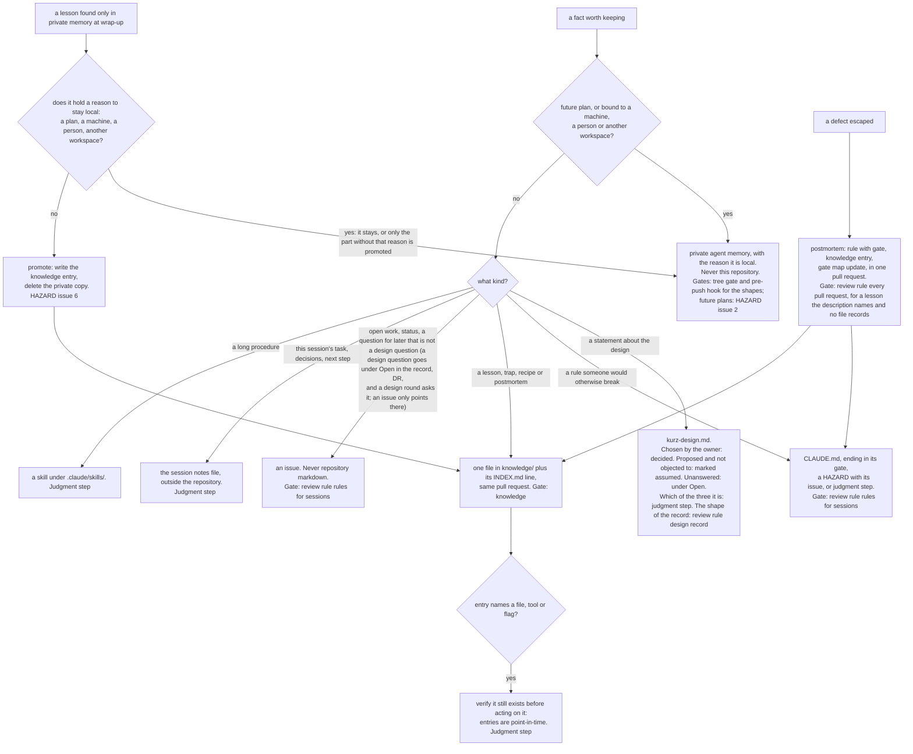

A fact is routed by its kind, never by convenience. When two stores fit, the more shared one
wins, with one exception that is specific to this repository: it is public, so a fact that is
bound to a machine or a person, and every future plan, stays out however useful it would be.
"Review rule" in a node means a section of `.review/review-rules.yaml`: a model reading one batch
of a diff (node R5 of [[diagram-gate-map]]).

## Update triggers

- The "Knowledge" rules or the "A public repository" rules in `CLAUDE.md` change: the whole tree.
- `tools/lint_knowledge.py` changes what it checks: the node KN.
- `tools/tree_gate.py`, `tools/kit.py` (its patterns) or `.githooks/pre-push` changes what it
  refuses: the node PM.
- `.review/review-rules.yaml` changes the sections "design record", "rules for sessions" or
  "every pull request": the nodes DR, CL, IS and PO.
- A HAZARD issue that a node names (2, 6) closes or opens: that node.
- A new store appears (a directory, a tracker label used as a store): a new branch under Q1.
