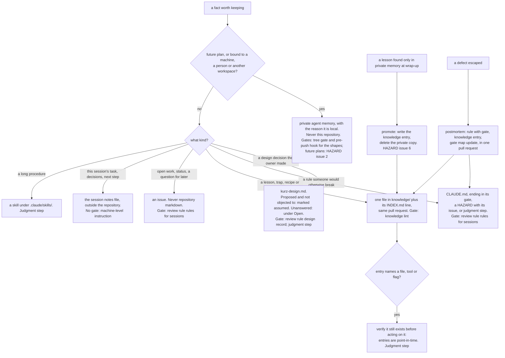

A fact is routed by its kind, never by convenience. When two stores fit, the more shared one
wins, with one exception that is specific to this repository: it is public, so a fact that is
bound to a machine or a person, and every future plan, stays out however useful it would be.

## Update triggers

- The "Knowledge" rules or the "A public repository" rules in `CLAUDE.md` change: the whole tree.
- `tools/lint_knowledge.py` changes what it checks: the node KN.
- `tools/tree_gate.py` changes its patterns: the node PM.
- A new store appears (a directory, a tracker label used as a store): a new branch under Q1.
